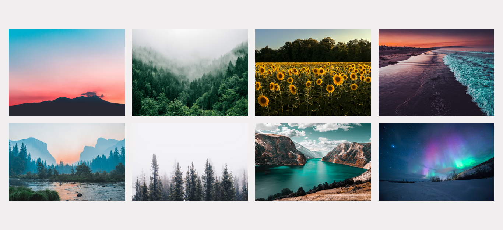

# Image Gallery

## Table of contents

- [Project Description](#project-description)
- [Screenshot](#screenshot)
- [Links](#links)
- [My process](#my-process)
  - [Built with](#built-with)
  - [What I learned](#what-i-learned)
  - [Useful resources](#useful-resources)
- [Author](#author)
- [Video Credits](#video-credits)

## Project Description

In this project, I built image gallery using HTML, CSS, and JavaScript.

## Screenshot

## Links

- Live Demo: [Github Pages]()

## My process

### Built with

 
 

### What I learned

When I started, I tried to follow this [tutorial](https://www.youtube.com/watch?v=sHG3Sf6XN9g&pp=ygUhaW1hZ2UgZ2FsbGVyeSBodG1sIGNzcyBqYXZhc2NyaXB0) and didn't understand the JavaScript portion of the video. The video linked in video credits below helped me out and I learned you can dynamically insert images via JavaScript with ease.

## Useful Resources

- Make your Favicon icon - [Favicon.io](https://favicon.io/favicon-generator/)
- Drag and Drop images to compress the them - [tinypng](https://tinypng.com/)

## Author

## Video Credits

In depth YouTube Tutorial - [Image Gallery using HTML, CSS, and JavaScript](https://www.youtube.com/watch?v=vQc3EmFCWRw)

How to optimize your images - [DON'T Serve Unoptimized Images - Webp, Srcset, ImageKit, and more!](https://www.youtube.com/watch?v=pfHG6HL1GBw)
